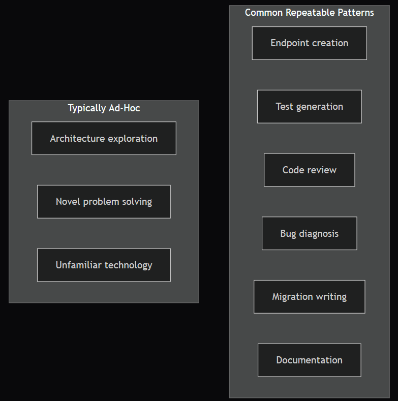

# From Ad-Hoc Prompts to Systematic Workflows

## The Problem with Ad-Hoc Prompting

Most developers start using AI tools the same way: they open a chat, type a question, get an answer, and move on. The next time they face a similar task, they start from scratch — rewriting the prompt, re-establishing context, and re-discovering what works.

This is the ad-hoc trap. It works, but it does not scale. A systematic approach transforms one-off prompting successes into repeatable workflows that produce consistent results every time.

This lesson teaches you to recognise repeatable patterns in your AI usage and convert them into documented, shareable workflows.

By the end of this lesson, you will be able to:

    Identify when an ad-hoc AI interaction should be formalised into a workflow
    Design workflows with the four-component structure (trigger, context, prompt sequence, verification)
    Iterate and improve workflows based on repeated use

## Recognising Repeatable Patterns

The first step is noticing when you are doing the same type of AI interaction repeatedly. Common development activities that follow consistent patterns include:



Pattern signals — you should formalise into a workflow when:

    You have prompted for the same type of task three or more times
    You find yourself copy-pasting parts of previous prompts
    Different team members are solving the same problem with varying prompt quality
    The task has a consistent input-output structure (e.g., "given a data model, produce CRUD endpoints")

Ad-hoc signals — keep it flexible when:

    The problem is genuinely novel (first-time architecture decisions)
    The context changes substantially each time
    The value is in exploration, not in a repeatable result

    Try it yourself: Think about your last five interactions with an AI development tool. For each one, ask: "Would the same prompt structure work for a similar task in the future?" Identify at least two interactions that follow a repeatable pattern.

## Anatomy of a Workflow

A development workflow has four components:

| Component	| Purpose	| Example |
 Trigger		| When to use this workflow		| "I need to add a new REST endpoint" |
| Context		| What information the AI needs		| Schema definition, existing endpoint example, coding conventions |
| Prompt sequence		| The steps to follow		| 1. Specify requirements (CoT) → 2. Generate code (few-shot) → 3. Review (role) |
| Verification		| How to confirm the result is correct		| Tests pass, linter clean, manual smoke test |

### Worked Example: The Endpoint Creation Workflow

Let us formalise the ad-hoc "build an endpoint" process into a structured workflow.

Trigger: You need to create a new REST endpoint for TundraBoard.

Context checklist:

    The Prisma model for the resource (or schema definition)
    One existing endpoint in the project as a convention example
    Any validation rules specific to this resource
    Authorisation requirements (who can access this endpoint?)

Prompt sequence:

    Requirements specification (Slot 3, CoT): "Think step by step about what a [METHOD] /[resource] endpoint needs. Consider: fields, validation, error cases, authorisation, response format. Context: [paste schema and requirements]."

    Implementation (Slot 1, few-shot): "Here is an existing endpoint: [paste example]. Generate the [new resource] endpoint following the same patterns."

    Error handling review (Slot 1, CoT): "Review this endpoint. Think through every way it could fail and verify each failure case is handled."

    Security review (Slot 3, role): "As a security engineer, review this endpoint for OWASP Top 10 vulnerabilities."

Verification:

    All generated code compiles without errors
    Tests cover the happy path and at least three error cases
    No hardcoded values or missing environment variables
    Security review findings addressed

This workflow is an example of what a documented workflow looks like for reference. You will learn comprehensive test design in Module 3 Lesson 1; for now you are reading the workflow shape, not executing the test-coverage step.

This workflow produces consistent, high-quality endpoints every time. A new team member can follow it on their first day.
Documenting Workflows for Reuse

A workflow is only useful if your future self (and your team) can find and follow it. Document workflows in a structured format:

```
# Workflow: [Name]

## Trigger
When to use this workflow.

## Prerequisites
What you need before starting (files, context, access).

## Steps
1. **[Phase name]** — Tool: [slot]. Pattern: [CoT/few-shot/role].
   - Prompt template: [the actual prompt with placeholders]
   - Expected output: [what good output looks like]

2. **[Phase name]** — ...

## Verification Checklist
- [ ] Check 1
- [ ] Check 2

## Notes
Lessons learned, common pitfalls, edge cases.
```

Store workflows where your team can find them — a shared repository, a wiki, or a dedicated /workflows directory in your project.

    Try it yourself: Take one of the repeatable patterns you identified earlier. Write out the four components (trigger, context, prompt sequence, verification) in the format above. Time yourself — it should take less than 10 minutes to document a workflow you have already done informally.

Iterating on Workflows

Workflows are living documents. After using a workflow three to five times, review it:

    What worked well? Keep those parts.
    Where did you deviate? The deviation might be an improvement — update the workflow.
    What context was missing? Add it to the prerequisites.
    What verification steps caught issues? Strengthen those checks.

Version your workflows alongside your code. When you change a coding convention (e.g., switching from Joi to Zod for validation), update the affected workflows so they stay current.

    Try it yourself: Imagine you have used the endpoint creation workflow five times. The last two times, you noticed the AI consistently generated overly permissive authorisation (allowing any authenticated user instead of checking workspace membership). How would you update the workflow's prompt sequence to prevent this?

Common Mistakes

    Over-engineering workflows too early — Do not formalise a pattern after using it once. Wait until you have done it at least three times and understand the variations.

    Making workflows too rigid — A good workflow provides structure but allows judgement. Include decision points ("If the resource has file uploads, add step 3b") rather than trying to cover every case.

    Not updating workflows — A workflow that references outdated tools, deprecated APIs, or old coding conventions causes more harm than having no workflow at all. Review quarterly.

    Keeping workflows private — If you have a workflow that saves you 30 minutes per endpoint, your entire team benefits from it. Share workflows actively.

Key Takeaways

    Systematic workflows transform ad-hoc prompting successes into repeatable, consistent processes
    A workflow has four components: trigger, context, prompt sequence, and verification
    Document workflows in a structured format that your team can find and follow
    Iterate on workflows after every few uses — they are living documents
    Wait for three repetitions before formalising a pattern

Retrieval Questions

    What are the four components of a development workflow, and what purpose does each serve?
    How do you distinguish a task that should be formalised into a workflow from one that should remain ad-hoc?
    Why is versioning workflows alongside your code important?
    After using a workflow five times, what questions should you ask to improve it?
