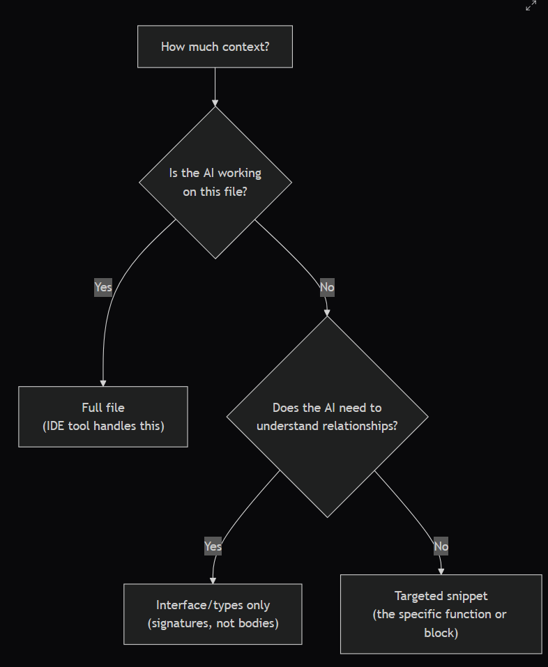
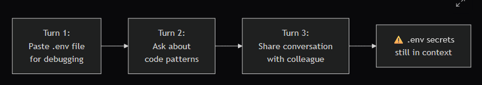

# Context Management & Window Optimisation

## Context Is Your Most Valuable Prompting Resource

The context you provide to an AI tool — the code, documentation, examples, and instructions in your prompt — determines the quality of the output. Too little context and the AI guesses; too much and it drowns in irrelevant information. The skill is knowing exactly what to include.

This lesson teaches you to make deliberate context decisions that maximise output quality while minimising cost and avoiding data leakage.

By the end of this lesson, you will be able to:

    Apply the context budget framework to decide how much code to include in any prompt
    Choose between full-file, interface-only, and targeted-snippet context strategies based on task requirements
    Prevent context accumulation from leaking sensitive data across conversation turns

## Full File vs Targeted Snippet

The most common context decision is how much of a file to include.

Full file — when the AI is editing or analysing the entire file. Your IDE tool typically handles this automatically by including the active file in context.

Interface only — when the AI needs to understand how other parts of the codebase interact with the current file but does not need their implementation details. Include type definitions, function signatures, and interface declarations — not function bodies.

Targeted snippet — when the AI needs to understand one specific function, block, or pattern. Extract the relevant 10-50 lines rather than including the full 500-line file.
Worked Example: Refactoring TundraBoard's Task Service

Suppose you want to refactor the updateTask function in TundraBoard. Here is how context decisions affect the prompt:

Poor context (too much):

    "Here is my entire project: [paste 15 files, 8,000 lines]. Refactor the updateTask function."

The AI is overwhelmed. It processes 8,000 lines to understand a 50-line function, costing tokens and likely missing the point.

Poor context (too little):

    "Refactor this function: [paste only updateTask, 30 lines]."

The AI does not know what TaskService, prisma, or the validation schema look like. It will guess at types and conventions.

Good context (targeted):

    "Refactor the updateTask function below. For context, I have included: (1) the Task Prisma model, (2) the validation schema for task updates, (3) the function signature of findTaskById which it calls. Conventions: we use Result types for error handling and separate validation from business logic.

    [paste updateTask: 30 lines] [paste Task model: 15 lines] [paste update schema: 10 lines] [paste findTaskById signature: 3 lines]"

This gives the AI exactly what it needs — 58 lines of focused context instead of 8,000 lines of noise.

    Try it yourself: Open any file in TundraBoard that is longer than 100 lines. Imagine you need the AI to refactor one function in that file. Identify: (1) the function itself, (2) the types and interfaces it uses, (3) the functions it calls. How many lines is your targeted context versus the full file?

## Context Budgeting

Context window sizes are finite. When working on complex tasks that require multiple files, you need to budget your context deliberately.
The Context Budget Framework

    Start with the target: The code you want the AI to work on (the function, file, or module being changed)
    Add direct dependencies: Types, interfaces, and function signatures that the target code references
    Add conventions: One example of the pattern you want followed (few-shot)
    Add instructions: Your specific request, constraints, and expected output format
    Evaluate: Is the total context within the model's window? Does every piece of context serve a purpose?

### Token Estimation Rules of Thumb

    One line of code ≈ 10-20 tokens (depending on line length)
    One TypeScript function (20 lines) ≈ 200-400 tokens
    One Prisma model (15 fields) ≈ 150-300 tokens
    A paragraph of instructions ≈ 50-100 tokens

### Context-Window Tiers (Q2 2026 snapshot)

The window you actually have available depends on the model tier you pick. The 2026 landscape:

|Tier | Window size | What you can fit | 
| Quick-tier completion models | 8K-32K | A single file or short conversation; inline-completion classifiers and small chat models live here | 
| Generation-tier flagships | 200K-1M | Most of a small-to-mid codebase — Claude (1M-context tier), GPT-4.1 (1M) | 
| Reasoning-tier models | 200K-1M | Same input window as generation-tier, but extended-thinking tokens count against the output budget — plan for 20K-40K of visible answer once thinking is metered | 
| Specialist long-context | 2M+ | Whole monorepos plus design docs — Gemini 2.0 family (2M) | 

(Specific model ↔ window pairings drift quarterly; check your provider's documentation for current numbers.)

For a generation-tier model with a 1M-token context window, you could in principle include 50,000-100,000 lines of code. You almost never should: the more context you include, the more the model has to process, the slower and more expensive the response, and the more likely it is to miss the important parts.

Optimal context is typically 200-2,000 tokens of highly relevant code plus 100-300 tokens of instructions. More is not always better — even when "more" is technically free under your context window.

    Try it yourself: Pick a function in TundraBoard that calls functions from other files. List every file that function depends on. Now estimate the total token count if you included all those files fully versus including only the relevant types and signatures. What is the ratio?

## Context Security: Avoiding Leakage

Context management has a security dimension. In multi-turn conversations, previous messages remain in context. This creates risk:

### Leakage Risks

    Context accumulation: Sensitive data shared in turn 1 persists through turns 2, 3, and beyond. If you paste a .env file early in a conversation, it is still in context when you later discuss unrelated code.

    Conversation sharing: Some tools allow sharing conversation links. If you share a conversation that contains sensitive data from earlier turns, the recipient sees everything.

    Context overflow: When context windows fill up, some tools summarise or truncate earlier messages. Sensitive data may appear in summaries sent to the model.

### Mitigations

    Start new conversations for sensitive topics rather than continuing existing ones
    Never paste credentials into any conversation, even temporarily
    Review the full conversation before sharing a link
    Use the abstraction technique (from Module 1) when discussing architecture that references sensitive systems

    Try it yourself: Open a multi-turn conversation in your web chat tool. Scroll to the beginning. Is there any information from earlier turns that you would not want a colleague to see? How would you restructure the conversation to avoid this?

## Strategies for Large Codebases

When working with large codebases (10,000+ lines), direct context inclusion becomes impractical. Instead, use these strategies:

Strategy 1: Progressive disclosure. Start with a high-level overview and drill down:

    Give the AI the project structure (file tree)
    Ask it to identify which files are relevant
    Include only those files in the next prompt

Strategy 2: Interface-first context. Include only type definitions and function signatures for the entire module, then full source for the specific file being edited.

Strategy 3: Codebase indexing. Some IDE tools and terminal agents index your entire codebase and retrieve relevant sections automatically. Understand how your tools handle this — it affects both quality and data security.

Strategy 4: Divide and conquer. Break large tasks into smaller, file-scoped sub-tasks. Refactor one file at a time rather than asking the AI to refactor the entire module at once.
## Common Mistakes

    Including everything "just in case" — More context is not always better. Irrelevant context dilutes the AI's attention and increases cost.

    Forgetting about context accumulation — In long conversations, earlier turns remain in context. Be aware of what has been shared.

    Not providing enough context for conventions — The AI cannot follow your project's patterns if you do not show them. Always include at least one example of the pattern you want.

    Ignoring context in the response — The AI's response also counts toward the context window. Long responses consume context that could be used for follow-up prompts.

## Key Takeaways

    Context quality matters more than context quantity — include exactly what the AI needs, nothing more
    Use the context budget framework: target → dependencies → conventions → instructions → evaluate
    Context security is a real concern — sensitive data persists across conversation turns
    For large codebases, use progressive disclosure, interface-first context, or divide-and-conquer strategies
    Start new conversations for sensitive topics rather than continuing existing ones

## Retrieval Questions

    When should you include a full file in context versus a targeted snippet? Give an example of each.
    Describe the context budget framework and its five steps.
    What is context accumulation, and why is it a security risk in multi-turn conversations?
    Name two strategies for managing context in large codebases and explain when each is most appropriate.
